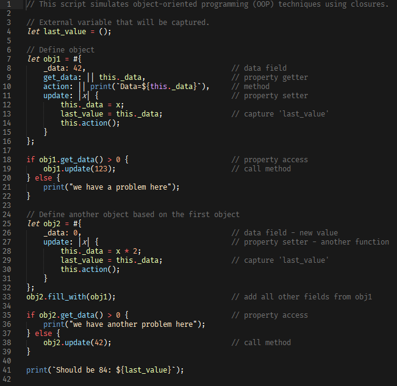

Syntax highlighting for Sublime Text
===================================

[Rhai](https://rhai.rs) is an embedded scripting language and evaluation engine for Rust that gives
a safe and easy way to add scripting to any application.

This repo provides syntax highlighting for [Sublime Text](https://www.sublimetext.com).

Screenshot
----------

